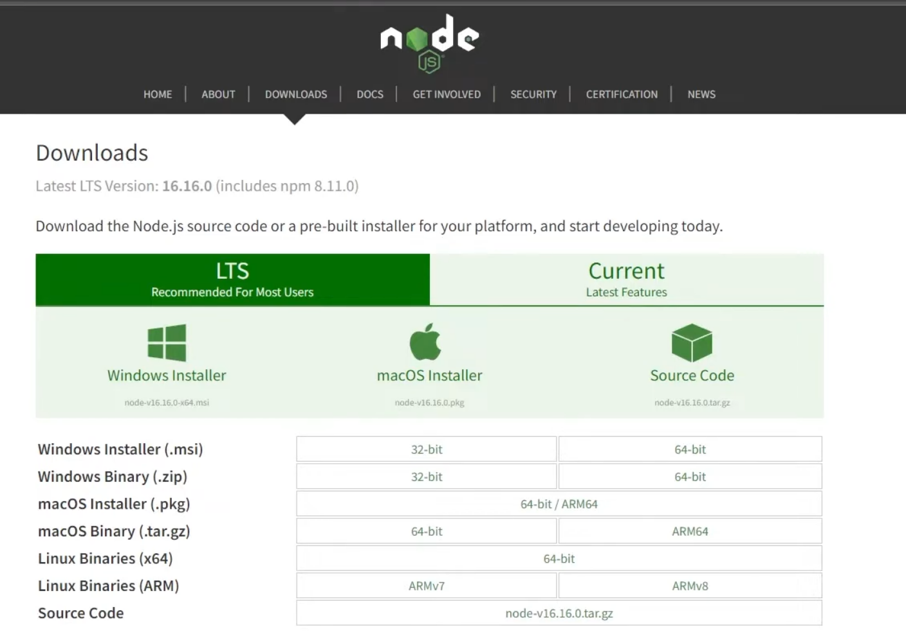
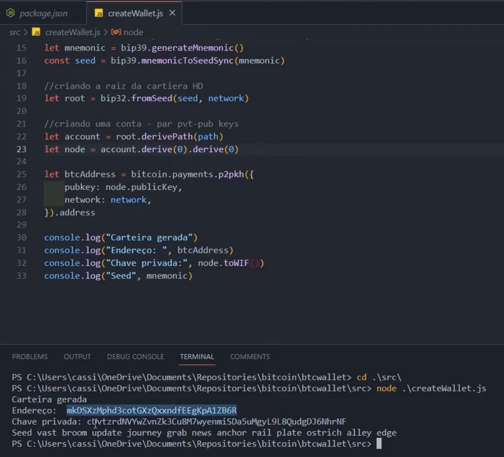
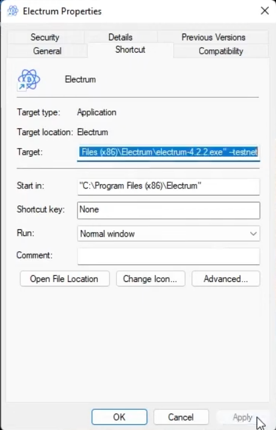
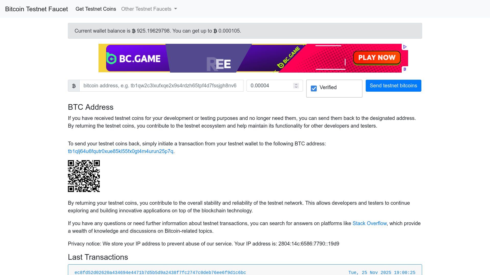
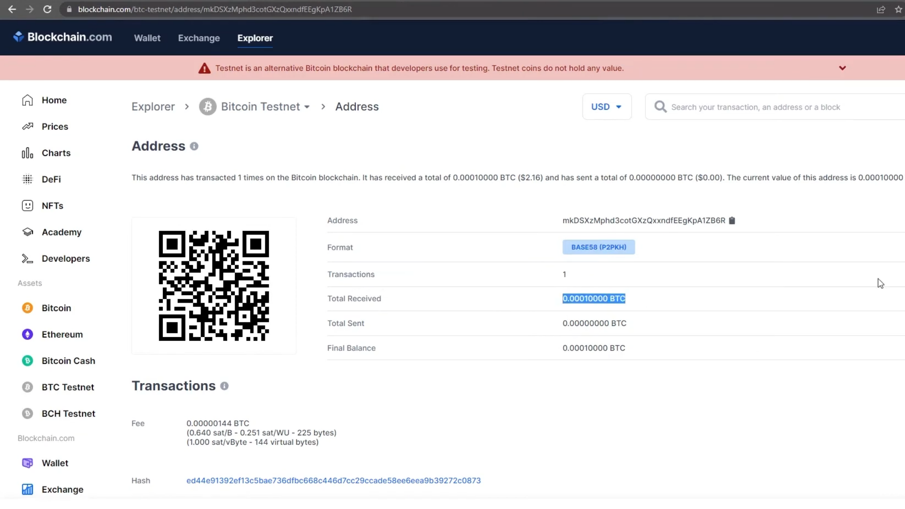

# Criando e Utilizando a sua Carteira de Criptomoedas - desafio 1
 
Olá, este é o meu repositório para o primeiro desafio do bootcamp "Binance - Blockchain Developer with Solidity 2025" da Dio.me! 

<br>

## Entendendo o Problema

Neste laboratório, o prof. Cassiano Peres tem como objetivo apresentar ao aluno como "criar um gerador de carteiras bitcoin, utilizando pares de chave pública e privada".


Além disso, neste laboratório o aluno ainda aprenderá a criar endereços de depósito e de envio de bitcoin usando da corteira gerada, bem como aprenderá a importar essa carteira criada dentro do Electrum, que é um aplicativo desktop para gerenciamento de transações em bitcoin. 


Outros requisitos:

- Linguagem JavaScript (Node-JS)
- Bitcoin Faucet Generator


Observe que, além dos requisitos principais, o professor Cassiano optou pela linguagem de programação JavaScript para a criação da carteira, usando o ambiente backend do Node-JS.


Finalmente, o professor também utilizará uma criptomoeda de teste (e estudo) chamada **Faucet**, que é uma criptomoeda sem valor de mercado, usada, então, para permitir essa maior imersão no contexto deste laboratório.  

<br>

## Preparando o Ambiente do Laboratório

Em termos da preparação do ambiente do laborátorio, o primeiro passo, então, seria conferir a instalação do Node-JS, uma vez que essa é a linguagem deste laboratório para a criação da carteira de bitcoin.


Nesse sentido, o Node-JS pode ser baixado a partir do seu site ou utilizando processos específicos de cada sistema operacional:

 


Depois de instalado o ambiente backend para o JavaScript, isto é, o Node-JS, pode-se conferir, tanto a instalação do Node-JS, como do gerenciador de pacotes do Node ou NPM, digitando no terminal do sistema operacional os seguintes comandos: **node -v** e **npm -v**


Já para guardar o projeto como um todo, o prof. Cassiano propõe a criação de uma pasta com o nome **BTCWALLET**, e explica que um projeto para o Node-JS pode ser iniciado através do gerenciado de pacotes NPM, digitando este comando no terminal: **npm -y**


A flag ou atributo **-y** permite o preencimento automático de alguns metadados para o projeto ao invés de se digitar manualmente tudo! E, a seguir, o professor Cassiano utiliza as seguintes dependências Node-JS neste projeto:

```
npm install bip39 bip32@2.0.6 bitcoinjs-lib --save
```


Acima temos duas bibliotecas sendo instaladas como dependências, além da instalação de duas versões diferentes para a mesma biblioteca **bip**. Observe, ainda, que o uso da flag **--save** hoje é opcional, mantido apenas em termos de compatibilidade, porque a partir da versão 5 do NPM, as dependẽncias já são adicionadas por padrão.


Ao final deste passo, é criada na raiz deste projeto um arquivo em formato JSON chamado **package.json**, que guarda os metadados deste projeto:

```
{
  "name": "btcwallet",
  "version": "1.0.0",
  "description": "",
  "main": "index.js",
  "scripts": {
    "test": "echo \"Error: no test specified\" && exit 1"
  },
  "keywords": [],
  "author": "ISC",
  "dependencies": {
    "bip32": "^2.0.6",
    "bip36": "^3.0.4",
    "bitcoinjs-lib": "^6.0.1"
  }
}
```


Já para o arquivo de código javascript do projeto, deve-se criar a pasta **src**: **createWallet.js**

```
// importando as dependẽncias
const bip32 = require(' bip32')
const bip39 = require('bip39')
const bitcoin = require('bitcoinjs-lib')

// Rede principal do Bitcoin - mainnet
// Rede de teste - testnet
const network = bitcoin.networks.testnet

// Derivação de carteiras HD
const path = `m/49' /1' /0' /0`

// Criar o mnemonic para a sedd (palavras de senha)
let mnemonic = bip39.generateMnemonic()
const seed = bip39.mnemonicToSeedSync(mnemonic)

// Criar a raiz da carteira HD
let root = bip32.fromSeed(seed, network)

// Criar uma conta bitcoin (com pvt-pub Keys) e contas derivadas
let account - root.derivePath(path)
let node = account.derive(0).derive(0)

let btcAddress = bitcoin.payments.p2pkh({
    pubkey: node.publicKey,
    network: network
}).address

console.log("Carteira gerada:")
console.log("Endereço:", btcAddress)
console.log("Chave privada:", node.toWIF())
console.log("Seed:", mnemonic)
```
 

Em relação ao código acima, observamos ao começo a importação daquelas dependências salvas no projeto, pudemos ver também a definição da rede de testes do bitcoin (**testnet**).


A seguir é chamado um método para criar o mnemônico, que é a sequência de palavras aleatórias que vão servir de referência para identicar o dono da carteira de bitcoin.


E, na sequência do código, uma conta de uso bitcoin é criada a partir de duas chaves assimétricas criptográficas; **private key** e **pubic key**, é definido o tipo de carteira de pagamentos **p2pkh**, e, finalmente, impresso na tela algumas das informações geradas pela aplicação: **btcAddress**, **chave privada** e **Seed/Mnemonic**.


Para se executar o script acima, basta acessar a pasta **src** e digitar no terminal o comando **node** com o nome do arquivo: **node ./createWallet.js**




Dentre as saídas importantes do código acima, podemos ver:

- **Endereço**: endereço de coneção para a conta da carteira crypto.
- **Chave privada**: esse hash deve ser usado para criar a conta na aplicação de gerenciamento de criptomoedas.
- **Seed**: trata-se do menemônico que permite acessar a carteira na aplicação de gerenciamento de criptomoedas.


Finalmente, para terminar a preparação do ambiente de teste do laboratório, é preciso baixar e instalar o software do gerenciador de carteiras bitcoin:


Um ponto interessate a se observar é que, se fosse o interesse deste laboratório, o próprio Electrum poderia criar por si só a carteira para ser usada nas transações de bitcoin que ele mesmo gerencia! 


Uma das razões de se criar carteiras por meio de código, como fora feito por meio do JavaScript, é para se permitir flexibilizar o uso das operações, permitindo automatizar as transações que se deseja realizadar!

<br>

## Operando Transações de Bitcoin com o Electrum

Como visto na seção anterior, o Electrum é um gerenciador de transações para bitcoins, que para o desenvolvimento do presente laboratório, ele está sendo usado para importar a carteira criada programaticamente pelo script JS no Node-JS.


Para tanto, é preciso usar a chave privada gerada pelo arquivo **createWallet.js**! Ademais, é preciso também configurar a execução do Electrum para ser usada a plataforma de testes **testnet** e não a plataforma principal de transações:




Vemos na imagem acima, que no Windows isso pode ser feito adicionando-se a flag **--testnet** ao comando de chamada da aplicação, quando se clica no ícone do programa e modifica-se o seu **target**!


Depois é preciso ir ao site da **bitcoin testnet faucet** para requerer uma quantidade limitada da **Faucet coin** para serem utilizadas nos testes deste laboratório:
 



Na sequência, podemos ver no site [Blockchain.com](https://www.blockchain.com), que é uma empresa de serviços financeiros para criptomoedas na Internet, que a nossa carteira gerenciada pelo Electrum possui transações com a bitcoin **faucet**:




<br>

> [!NOTE]
> Observer que embora a **faucet coin** seja uma cripto moeda sem valor financeiro voltada para testes, ela também é transacionada como se estivesse portando uma transação padrão, de modo que pode demorar alguns minutos para a remessa das moedas recebidas estarem disponíveis para uso.
> Ademais, sublinha-se que o site **bitcoin testnet faucet** pede encarecidamente que após os testes as moedas faucet remanescentes sejam reenviadas de volta para o site para serem reutilizadas por outros desenvolvedores!!! ;)


Interessante notar ainda, que os testes das transações financeiras podem utilizar o mesmo programa javascript para a criação de novas carteiras e endereços como destino para as **faucet coins**: **createWallet.js**


<br>

##  


<br>

## Considerações Finais 


<br>

## Outros links:

 - [linkedin:] https://www.linkedin.com/in/marcus-vinicius-richa-183104199/
 - [Github:] https://github.com/ahoymarcus/
 - [My Old Web Portfolio:] https://redux-reactjs-personal-portfolio-webpage-version-2.netlify.app/


